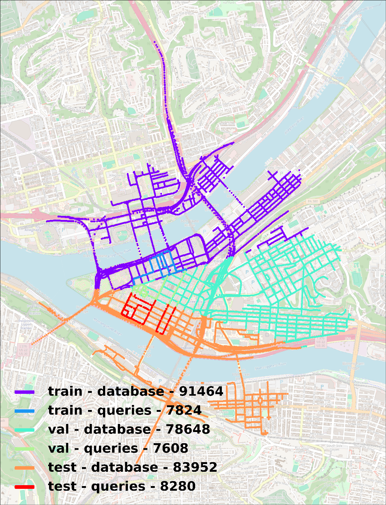
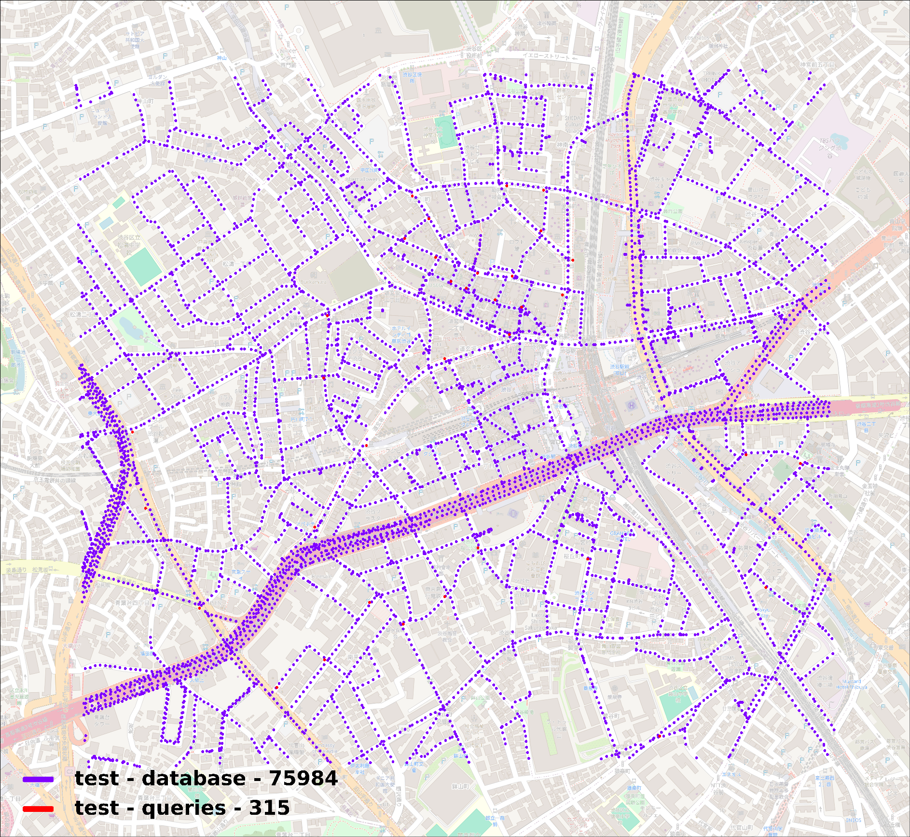

# Doppelgangers: Learning to Disambiguate Images of Similar Structures

[[Running on Customized Data]](#running-on-customized-data)
[[Experiments On Pre-trained Model]](#exp-results)

[Ruojin Cai](https://www.cs.cornell.edu/~ruojin/)<sup>1</sup>,
[Joseph Tung]()<sup>1</sup>,
[Qianqian Wang](https://www.cs.cornell.edu/~qqw/)<sup>1</sup>,
[Hadar Averbuch-Elor](https://www.elor.sites.tau.ac.il/)<sup>2</sup>,
[Bharath Hariharan](https://www.cs.cornell.edu/~bharathh/)<sup>1</sup>,
[Noah Snavely](https://www.cs.cornell.edu/~snavely/)<sup>1</sup>
<br>
<sup>1</sup>Cornell University,  <sup>2</sup>Tel Aviv University
<br>
ICCV 2023 Oral

#### [Project Page](https://doppelgangers-3d.github.io/) | [Paper](https://arxiv.org/pdf/2309.02420.pdf) | [Arxiv](https://arxiv.org/abs/2309.02420) | [Dataset](https://github.com/RuojinCai/doppelgangers/blob/main/data/doppelgangers_dataset/README.md)

<p float="left">
    
</p>

Implementation for paper "Doppelgangers: Learning to Disambiguate Images of Similar Structures", which proposes a learning-based approach to disambiguate distinct yet visually similar image pairs (doppelgangers) and applies it to structure-from-motion disambiguation.

## Dependencies

1. Create Conda environment with Python 3.8, PyTorch 1.12.0, and CUDA 10.2 using the following commands:

  ```bash
  conda env create -f ./environment.yml
  conda activate doppelgangers
  ```

2. Download Colmap from their [installation page](https://colmap.github.io/install.html) (version 3.8+).

## Pretrained Model

- Pretrained model is available in the following [link](https://doppelgangers.cs.cornell.edu/dataset/checkpoint.tar.gz).
To use the pretrained models, download the `checkpoint.tar.gz` file, unzip and put `doppelgangers_classifier_loftr.pt` under `./weights/` folder.
  <details>
  <summary>[Click to expand]</summary>

  ```bash
  cd weights/
  wget -c https://doppelgangers.cs.cornell.edu/dataset/checkpoint.tar.gz
  tar -xf checkpoint.tar.gz
  mv doppelgangers/checkpoints/doppelgangers_classifier_loftr.pt ./
  rm checkpoint.tar.gz
  rm -r doppelgangers/
  ```

  </details>

- We use [LoFTR](https://github.com/zju3dv/LoFTR) models for feature matching. Please download the LoFTR outdoor checkpoint `outdoor_ds.ckpt` in the following Google Drive [link](https://drive.google.com/file/d/1M-VD35-qdB5Iw-AtbDBCKC7hPolFW9UY/view?usp=drive_link), and put it under `./weights/` folder.

## Dataset

This section contains download links for several helpful datasets:

- **SfM Disambiguation**: Download the *Structure from Motion disambigaution Dataset* from the [SfM disambiguation with COLMAP](https://github.com/cvg/sfm-disambiguation-colmap/tree/main#datasets) GitHub repository. Unzip the file under folder `./data/sfm_disambiguation/`.
- **Pairwise Visual Disambiguation**: Download the *Doppelgangers Dataset* by following [these instructions](https://github.com/RuojinCai/doppelgangers/blob/main/data/doppelgangers_dataset/README.md) and put the dataset under folder `./data/doppelgangers_dataset/`.

## SfM Disambiguation

#### Overview of applying Doppelgangers classifier to SfM disambiguation with COLMAP

- We begin by performing COLMAP feature extraction and matching, which generates a list of image pairs.
- Next, we run Doppelgangers classifiers on these image pairs, with LoFTR matches as input.
- We then remove image pairs from the COLMAP database if they have a predicted probability below the specified threshold. These pairs are more likely to be Doppelgangers.
- Finally, we perform COLMAP reconstruction with the pruned database.

#### Demo

We provide a demo on the Cup dataset to demonstrate how to use our Doppelgangers classifier in Structure from Motion disambiguation with COLMAP: `./notebook/demo_sfm_disambiguation.ipynb`.

#### Script

We provide a script for SfM disambiguation. The COLMAP reconstruction with Doppelgangers classifier can be found at `[output_path]/sparse_doppelgangers_[threshold]/`.

```bash
# Usage:
# python script_sfm_disambiguation.py [path/to/example_config] --input_image_path [path/to/dataset] --output_path [path/to/output]
python script_sfm_disambiguation.py doppelgangers/configs/test_configs/sfm_disambiguation_example.yaml \
  --colmap_exe_command colmap \
  --input_image_path data/sfm_disambiguation/yan2017/cup/images \
  --output_path results/cup/ \
  --threshold 0.8 \
  --pretrained weights/doppelgangers_classifier_loftr.pt
```

<details>
  <summary>Details of the Arguments: [Click to expand]</summary>

- To apply the Doppelgangers classifier on custom datasets, change the argument `--input_image_path [path/to/dataset]` to the dataset path accordingly,
and set the path for output results using the argument `--output_path [path/to/output]`.
- If you have already completed COLMAP feature extraction and matching stage, you can skip this stage with the `--skip_feature_matching` argument, and specify the path to `database.db` file using the argument `--database_path [path/to/database.db]`.
  <details>
  <summary>Example [Click to expand]</summary>

  ```bash
  python script_sfm_disambiguation.py doppelgangers/configs/test_configs/sfm_disambiguation_example.yaml \
    --colmap_exe_command colmap \
    --input_image_path data/sfm_disambiguation/yan2017/cup/images \
    --output_path results/cup/ \
    --skip_feature_matching \
    --database_path results/cup/database.db
  ```

  </details>

- Use the argument `--skip_reconstruction` to skip the standard COLMAP reconstruction w/o Doppelgangers classifier.
- Change doppelgangers threshold with argument `--threshold` and specify a value between 0 and 1. A smaller threshold includes more pairs, while a larger threshold filters out more pairs. The default threshold is set to 0.8. When the reconstruction is split into several components, consider using a smaller threshold. If the reconstruction is not completely disambiguated, consider using a larger threshold.
- Pretrained model can be specified by the argument `--pretrained [path/to/checkpoint]`.

</details>

#### Reconstruction Results

[COLMAP](https://colmap.github.io/) reconstructions w/ and w/o Doppelgangers classifier of the test scenes described in the paper: [reconstructions.tar.gz](https://doppelgangers.cs.cornell.edu/dataset/reconstructions.tar.gz) (3G)

## Pairwise Visual Disambiguation

### Method overview


(a) Given a pair of images, we extract keypoints and matches via feature matching methods. Note that this is
a negative (doppelganger) pair picturing opposite sides of the Arc de Triomphe. The feature matches are primarily in the top part of the
structure, where there are repeated elements, as opposed to the sculptures on the bottom part.
(b) We create binary masks of keypoints and matches. We then align the image pair and masks with an affine transformation estimated from matches.
(c) Our classifier takes the
concatenation of the images and binary masks as input and outputs the probability that the given pair is positive.

### Testing the pretrained model

```bash
# Usage:
# python test.py [path/to/config] --pretrained [path/to/checkpoint]
python test.py doppelgangers/configs/training_configs/doppelgangers_classifier_noflip.yaml \
  --pretrained weights/doppelgangers_classifier_loftr.pt
```

### Training

```bash
# Usage:
# python train.py [path/to/config] 
# python train_multi_gpu.py [path/to/config]
python train.py doppelgangers/configs/training_configs/doppelgangers_classifier_noflip.yaml

# training with multiple gpus on Doppelgangers dataset with image flip augmentation
python train_multi_gpu.py doppelgangers/configs/training_configs/doppelgangers_classifier_flip.yaml
```

## Citation

```
@inproceedings{cai2023doppelgangers,
  title     = {Doppelgangers: Learning to Disambiguate Images of Similar Structures},
  author    = {Cai, Ruojin and Tung, Joseph and Wang, Qianqian and Averbuch-Elor, Hadar and Hariharan, Bharath and Snavely, Noah},
  journal   = {ICCV},
  year      = {2023}
}
```

# Running on Customized Data

## Soving Environment

### Running in a Docker Env smoothly

- Docker image: `pytorch/pytorch:1.12.0-cuda11.3-cudnn8-devel`
- Env: python 3.7, pytorch 1.12, CUDA 11.3
- Using pip with specific source

  ```zsh
  pip install -i https://mirrors.aliyun.com/pypi/simple/ -r requirements.txt
  ```

### Setup the environment via conda

```bash
conda create -n doppelgangers python=3.9
./setup_conda.sh doppelgangers # install Anyloc dependences
pip install -r requirements.txt # install doppelgangers dependences
```

## Data Preparation

- Images

  ```bash
  TODO:
  Download GV-Bench from google drive from comandline
  gdown 
  ```

- Image Pairs metadata `.npy`

  ```bash
  python tools/preprocess.py --pairs --root_dir --txt_path --npy_path 
  ```

  ```python
  array([
    image_0_relative_path : str,
    image_1_relative_path : str,
    pos_neg_pair_label (pos=1, neg=0) : int,
    number_of_SIFT_matches : int
  ])
  ```

- Loftr Matching Pairs `.npy`

  ```bash
  python tools/preprocess.py --root_dir data/GV-Bench/images \ 
    --npy_path data/GV-Bench/pairs_metadata/day.npy \
    --output data/GV-Bench/loftr_matches/day \
    --weights weights/outdoor_ds.ckpt \
    --loftr
  ```

  ```bash
  {name}.npy
  name is the order of pairs in image pairs metadata
  ```

- Pretrained Model

  ```bash
  # use pretrained models in original release
  # configs in doppelgangers/config/gvbench
  python test.py doppelgangers/config/gvbench/{config}.yaml
  # plot PR-Curve
  python tools/eval_helper.py --pr --val_logs /path/to/val/logs
  # The PR-Curve will be saved at the val_log folder
  ```

## Exp results
  
- Max Recall @100Precision (MR%)
  | Method | Day | Night| Season| Weather|
  | :------|:----|:-----|:------|:-------|
  | GV (SP+SG)|**48.267**|**30.609**|**66.514**|**74.633**|
  | GV (LoFTR)|45.336|18.206|12.096|18.206|
  | Doppelgangers| 35.465| 1.991| 22.435| 30.011|

- Average Precision (AP%)
  | Method | Day | Night| Season| Weather|
  | :------|:----|:-----|:------|:-------|
  | GV (SP+SG)|**99.634**|95.969|99.911|**99.907**|
  | GV (LoFTR)|99.500|**97.881**|**99.874** | 97.881|
  | Doppelgangers| 97.056| 60.759| 99.134| 99.574|

## Fintune or train from scratch

### Train from scratch (on Pittsburgh250k dataset)

#### Steps

- Split the original Pittsburgh250k dataset via [VPR-datasets-downloader](https://github.com/gmberton/VPR-datasets-downloader) in `train`, `val` and `test`.
- Generate visually similar pairs via [AnyLoc(RAL2023)](https://anyloc.github.io/)
- Pre-process the data as listed in [Data Preparation section](#data-preparation) above.
- Train the model and validate.
- Evaluation on `test` set and `GV-Bench`.

#### Dataset Download and Preparation

Follow the instructions in [VPR-datasets-downloader](https://github.com/gmberton/VPR-datasets-downloader).

<p align="center">
    
</p>

#### Generate visually similar pairs

Two types of pairs FPs (False Positives) and FNs (False Negatives) are what we are interested in.

##### False Positives

  We proposed to use [AnyLoc(RAL2023)](https://anyloc.github.io/) to generate pairs for training.

- Use AnyLoc to retrieve TopK candidates. (TopK = 200 is used)
  - Extract AnyLoc-VLAD descriptors.

  ```bash
  python anyloc_inference.py anyloc/config/pitts250k_train.yaml
  ```

  The extracted descriptors are in the same directory where the images are stored with identical file names but `.npy` extensions.
  - Retrieve

  ```bash
  python anyloc_inference.py anyloc/config/pitts250k_train.yaml --retrieval
  ```

  The retrieved results are in three parts:
  1. `dists_{topk}.npy`: Distances/Similarities of topk retrievals.
  2. `indices_{topk}.npy`: Topk retrieved database image indices.
  3. `recalls_{topk}.npy`: Recalls for topk retrieval.

- Generate training pairs from retrieved candidates. (Top20)
  - Train Set: Positive Pairs: 68992, Negative Pairs: 87488
  - Val Set: Positive Pairs: 69794, Negative Pairs: 82366
  - Test Set: Positive Pairs: 73407, Negative Pairs: 92193
  
#### Exps:
| Train Strategy | Test Set|AP(%) | MR(%)| PR-Curve|
| :------:|:----:|:-----:| :----:|:----:|
| [Pretained(Doppelgangers)](val_logs/doppelgangers_classifier_noflip_pitts250k_val_2024-Jun-21-18-10-52)| Pitts250k Test| 61.191| 0|[file](val_logs/doppelgangers_classifier_noflip_pitts250k_val_2024-Jun-21-18-10-52/pr_curve.pdf) | 
| [Pretrained(Doppelgangers)](val_logs/doppelgangers_classifier_noflip_pitts250k_val_val_2024-Jun-21-22-06-51)| Pitts250k Val | 43.636 | 0 | [file](val_logs/doppelgangers_classifier_noflip_pitts250k_val_val_2024-Jun-21-22-06-51/pr_curve.pdf)|
| From sctrach (Pitts250k Train, epoch=10)| Pitts250k Train|93.372| |


### Tokyo247 dataset

#### Dataset Download and Preparation

Follow the instructions in [VPR-datasets-downloader](https://github.com/gmberton/VPR-datasets-downloader).

<p align="center">
    
</p>

- Use AnyLoc to Retrieve TopK candidates
  
  
  